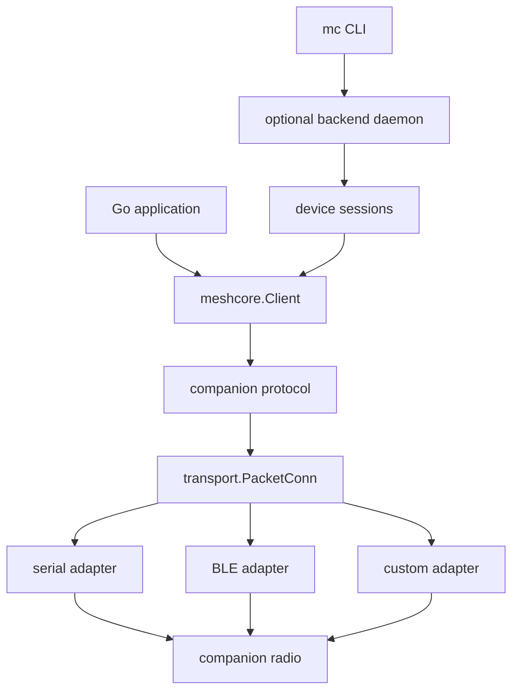

# meshcore-go

**Reusable Go toolkit for MeshCore-compatible companion radios.**

Build terminal clients, automations, gateways, monitoring tools, and custom integrations on top of a single transport-independent SDK.

> [!WARNING]
> `meshcore-go` is under active development. Public APIs, package names, and configuration formats may change before the first stable release.

> [!TIP]
> Looking for the terminal client? See [`mc`](./cmd/mc/README.md).

## Overview

`meshcore-go` provides a reusable Go implementation of the MeshCore companion-radio protocol.

Applications interact with a high-level `meshcore.Client` instead of manually dealing with serial framing, BLE characteristics, packet sequencing, response matching, or asynchronous push messages.

```text
application
    │
    ▼
meshcore.Client
    │
    ▼
companion protocol
    │
    ▼
transport.PacketConn
    │
    ├── serial://
    ├── ble://
    └── custom transports
```

The same SDK can be reused by small scripts, long-running services, Home Assistant bridges, MQTT gateways, desktop applications, and experimental tooling.

## What is included?

| Path                                      | Purpose                                                                        |
| ----------------------------------------- | ------------------------------------------------------------------------------ |
| [`meshcore`](./client.go)                 | High-level SDK for interacting with companion radios                           |
| [`protocol/`](./protocol)                 | Companion-protocol encoding, decoding, initialization, and capability handling |
| [`transport/`](./transport)               | Packet-oriented transport interfaces, registry, and endpoint discovery         |
| [`transport/serial/`](./transport/serial) | USB serial transport                                                           |
| [`transport/ble/`](./transport/ble)       | Bluetooth Low Energy transport                                                 |
| [`transport/tcp/`](./transport/tcp)       | MeshCore companion stream transport over TCP                                   |
| [`backend/`](./backend)                   | Optional multi-session backend daemon, storage, device sessions, and bridges   |
| [`cmd/mc/`](./cmd/mc)                     | Practical command-line client built on top of the SDK                          |
| [`examples/`](./examples)                 | Minimal runnable examples                                                      |

## Install

`meshcore-go` currently requires Go 1.25 or newer.

```sh
go get github.com/meshcore-cz/meshcore-go
```

Import the root package as:

```go
import meshcore "github.com/meshcore-cz/meshcore-go"
```

## Quick start

Connect to a companion radio over USB serial and print its identity:

```go
package main

import (
	"context"
	"fmt"
	"log"

	meshcore "github.com/meshcore-cz/meshcore-go"
)

func main() {
	ctx := context.Background()

	client, err := meshcore.Dial(ctx, "serial:///dev/ttyACM0")
	if err != nil {
		log.Fatal(err)
	}
	defer client.Close()

	info, err := client.DeviceInfo(ctx)
	if err != nil {
		log.Fatal(err)
	}

	fmt.Printf("Name:       %s\n", info.Name)
	fmt.Printf("Firmware:   %s %s\n", info.FirmwareName, info.FirmwareVersion)
	fmt.Printf("Public key: %s\n", info.PublicKey)
}
```

The same API works over BLE:

```go
client, err := meshcore.Dial(ctx, "ble://C4:20:12:34:56:78")
```

## Discover radios

Serial and BLE discovery are available through a shared endpoint model:

```go
endpoints, err := meshcore.Discover(
	ctx,
	meshcore.WithSerialDiscovery(),
	meshcore.WithBLEDiscovery(),
)
if err != nil {
	log.Fatal(err)
}

for _, endpoint := range endpoints {
	fmt.Printf(
		"%-6s %-30s %s\n",
		endpoint.Transport,
		endpoint.URI,
		endpoint.Name,
	)
}
```

Discovery returns candidate endpoints. The protocol handshake performed by `meshcore.Dial` verifies whether an endpoint is a compatible companion radio.

## Built-in transports

| Transport  | Endpoint example          | Status              |
| ---------- | ------------------------- | ------------------- |
| USB serial | `serial:///dev/ttyACM0`   | Built in            |
| USB serial | `serial:///dev/ttyUSB0`   | Built in            |
| BLE        | `ble://C4:20:12:34:56:78` | Built in            |
| TCP        | `tcp://192.168.1.20:5000` | Built in            |
| Custom     | `your-scheme://...`       | Register externally |

Transports expose complete companion-protocol packets through a small interface:

```go
type PacketConn interface {
	Open(ctx context.Context) error
	Close() error

	ReadPacket(ctx context.Context) ([]byte, error)
	WritePacket(ctx context.Context, packet []byte) error

	String() string
}
```

Transport-specific details remain hidden inside each adapter.

## SDK capabilities

The SDK is intentionally higher-level than the underlying protocol.

| Area                 | Selected API                                                            |
| -------------------- | ----------------------------------------------------------------------- |
| Connections          | `Dial`, `New`, `Connect`, `Close`                                       |
| Discovery            | `Discover`, `WithSerialDiscovery`, `WithBLEDiscovery`, `WithDiscoverer` |
| Device information   | `DeviceInfo`, `FirmwareVersion`, `BatteryMillivolts`                    |
| Device control       | `DeviceTime`, `SyncClock`, `Advertise`, `Reboot`                        |
| Contacts             | `Contacts`, `ContactsWithProgress`, `Contact`                           |
| Channels             | `Channels`, `Channel`                                                   |
| Messages             | `SendText`, `SendChannelText`, `SyncMessages`, `WaitForAcknowledgement` |
| Asynchronous events  | `Events`, `WithMessageSync`, `WithEventHook`                            |
| Routing              | `Trace`, `TraceContact`                                                 |
| Mesh discovery       | `DiscoverNodes`                                                         |
| Repeaters            | `RepeaterLogin`, `RepeaterStatus`, `RepeaterNeighbours`, `RepeaterExec` |
| Protocol exploration | `RawSend`, `RawPackets`                                                 |
| Extensibility        | `WithTransportRegistry`, `WithClientOptions`, `WithProtocol`            |

Some advanced protocol operations are still evolving and may depend on the capabilities exposed by the connected firmware.

## Architecture



The separation is deliberate:

* applications use a stable high-level client;
* the protocol layer owns encoding, decoding, and request sequencing;
* each transport owns its low-level framing;
* custom integrations can add new transports without forking the SDK;
* the CLI remains one consumer of the library rather than the center of the project.

## Custom transports

URI-based dialing is extensible through a transport registry.

```go
registry := meshcore.DefaultRegistry()
registry.Register("example", yourDialer)

client, err := meshcore.Dial(
	ctx,
	"example://radio",
	meshcore.WithTransportRegistry(registry),
)
```

A custom discovery mechanism can be added separately:

```go
endpoints, err := meshcore.Discover(
	ctx,
	meshcore.WithDiscoverer(yourDiscoverer),
)
```

This allows integrations to expose companion radios through alternative bridges, local services, or experimental transports while reusing the same client API.

## Included command-line client

The repository includes [`mc`](./cmd/mc), a practical terminal client built on top of `meshcore-go`.

```sh
mc connect
mc discover
mc status
mc contacts
mc inbox
mc send alice "hello"
mc watch
```

The CLI adds user-facing concerns such as saved profiles, local state, terminal output, aliases, structured JSON output, and backend lifecycle management.

See [`cmd/mc/README.md`](./cmd/mc/README.md) for installation and usage.

### Install `mc`

Homebrew (macOS and Linux):

```sh
brew install meshcore-cz/tap/mc
```

Or download a prebuilt binary for your platform from the [Releases page](https://github.com/meshcore-cz/meshcore-go/releases), verify it against `SHA256SUMS`, and put it on your `PATH`:

```sh
tar -xzf mc_v0.2.0_darwin_arm64.tar.gz
install -m 755 mc /usr/local/bin/mc
```

Releases include Linux (`amd64`/`arm64`), macOS (`amd64`/`arm64`), and Windows (`amd64`).

Or build from source with the version stamped in:

```sh
make build          # -> bin/mc
make install        # -> $GOBIN/mc
go install github.com/meshcore-cz/meshcore-go/cmd/mc@latest
```

`mc version` reports the build version and commit. `make dist` cross-builds every release platform into `dist/` (run it on macOS to include the cgo darwin binaries).

### Docker

Multi-arch (`amd64`/`arm64`) images are published to GitHub Container Registry on every tagged release:

```sh
docker run --rm ghcr.io/meshcore-cz/mc:latest version
```

Tags follow the release: `latest`, the full version (`0.2.0`), and the minor series (`0.2`).

The image entrypoint is `mc`, so pass subcommands directly. A TCP radio is the most container-friendly transport:

```sh
docker run --rm -it \
  -v mc-state:/root/.local/state/mc \
  ghcr.io/meshcore-cz/mc:latest connect tcp://10.0.0.30:5000
```

Serial and Bluetooth radios need host access (`--device /dev/ttyUSB0`, or `--privileged` plus a D-Bus mount for BLE), so for those a native install is usually simpler.

### Cutting a release

Tag a clean `main` and let CI build and publish the binaries:

```sh
make release VERSION=v0.2.0
```

The target verifies the tree, runs `make check`, then creates and pushes the annotated tag. Pushing a `v*` tag triggers the `Release` workflow, which builds `mc` for every platform, attaches the archives plus `SHA256SUMS` to the GitHub Release, and updates the `mc` formula in [`meshcore-cz/homebrew-tap`](https://github.com/meshcore-cz/homebrew-tap).

> The tap update needs a `HOMEBREW_TAP_TOKEN` repository secret — a token with `contents:write` on `meshcore-cz/homebrew-tap`. Without it, the release still publishes; only the Homebrew bump is skipped.

## Optional local backend

The [`backend`](./backend) package supports longer-running local workflows where repeatedly opening a radio connection for every operation would be wasteful.

It is structured as a single **daemon** (supervisor) that owns one Unix socket, a shared store, and request routing, supervising one or more isolated **device sessions** — one per logical radio. Each session keeps its own connection, radio serialisation, replica, diagnostics, and bridges, so a slow operation on one radio never blocks another. This is one OS process with many sessions, not a process per radio.

It provides reusable building blocks for:

* a multi-session daemon (`backend.Daemon`) and per-radio sessions (`backend.DeviceSession`);
* a local IPC client (`backend.Client`) with optional per-device routing;
* one persistent local-state database per device (`backend.SQLiteStateStore`), keyed and validated by the device's full public key at `~/.local/state/mc/devices/<public-key-prefix>.db`, holding contacts, channels, repeater sessions, and message history;
* backend-driven inbox draining (`Client.DrainMessages`): the backend is the sole inbox consumer, persisting each message before broadcasting it;
* per-device autostart and lifecycle control;
* optional per-device TCP and PTY bridge endpoints;
* an optional embedded web dashboard (see below).

Device-local state is not a cache: it may be stale, incomplete, or locally enriched, and is never silently reused across a changed device identity.

The backend is useful for CLI workflows and integrations, but it remains separate from the core SDK.

### Web dashboard

The daemon can serve an optional embedded web dashboard (a SvelteKit static app built
into the `mc` binary) for monitoring and basic control: device status, session
start/stop/restart, sending direct and channel messages, triggering adverts, sending
raw packets, and live log views: a **Companion Log** of companion frames in both
directions (host↔radio) and an **RF Log** of over-the-air packets — received (with
SNR/RSSI) and transmitted by us — decoded with meshpkt. It is opt-in via the config
file:

```yaml
backend:
  http:
    enabled: true
    port: 8080         # default 8080
    host: 127.0.0.1    # default 127.0.0.1 (loopback only); set 0.0.0.0 to expose on the LAN
```

With it enabled, `mc backend start` brings up the dashboard at `http://127.0.0.1:8080`.
The server reuses the daemon's IPC surface (the same one the CLI uses) and serves no
radio state of its own; live updates (incoming messages, adverts, status) stream over a
WebSocket. There is no authentication, so the loopback default is recommended unless the
host is otherwise protected.

The frontend sources live under [`backend/web/frontend`](./backend/web/frontend); the
built output in `backend/web/frontend/build` is committed and embedded, so `go build`
needs no Node toolchain. After changing the frontend, run `make web` to rebuild it.

## Examples

Minimal runnable programs are available under [`examples/`](./examples):

```sh
go run ./examples/discover
go run ./examples/device-info serial:///dev/ttyACM0
```

## Firmware compatibility

`meshcore-go` targets MeshCore-compatible companion radios rather than one exact firmware build.

The base client handles the shared companion protocol. Firmware-specific behavior should be isolated behind capability detection or optional extensions wherever possible.

## Project status

The project is usable for experimentation and active development, but it is not yet a stable compatibility promise.

Current focus:

* solidifying the reusable SDK;
* improving serial and BLE support;
* expanding hardware verification;
* keeping protocol behavior capability-aware;
* improving the `mc` terminal client;
* making custom integrations straightforward.

## Documentation

* [`cmd/mc/README.md`](./cmd/mc/README.md) — command-line client guide
* [`docs/design.md`](./docs/design.md) — architecture, design principles, and longer-term direction
* [`examples/`](./examples) — small runnable programs

## Contributing

Bug reports, protocol observations, hardware test results, transport experiments, and focused pull requests are welcome.

When adding functionality, keep the project boundaries clear:

* companion-protocol behavior belongs in the reusable SDK;
* transport-specific framing belongs in `transport/`;
* terminal UX belongs in `cmd/mc`;
* optional persistent workflows belong in `backend/`.

## License

MIT
